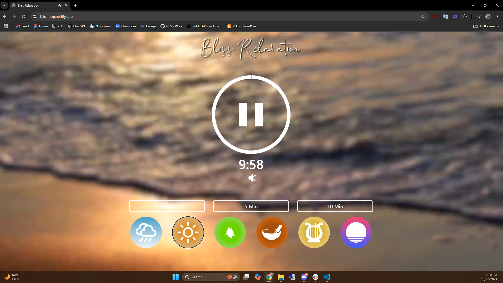
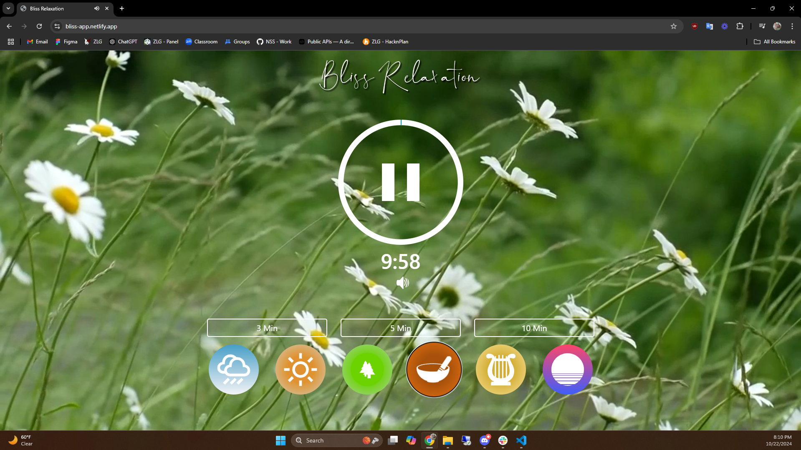
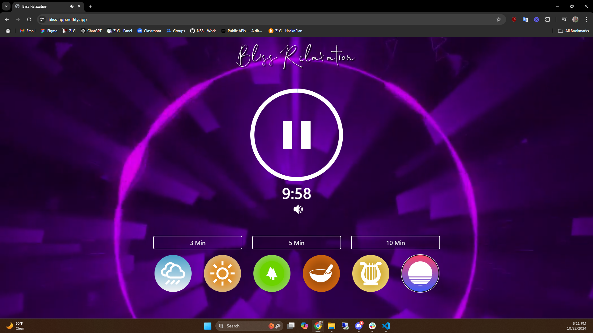
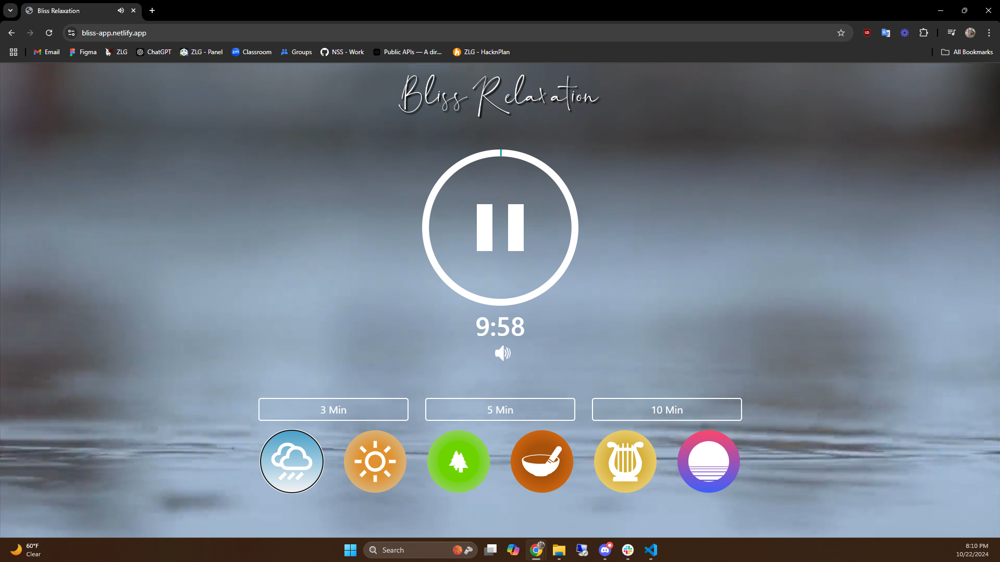
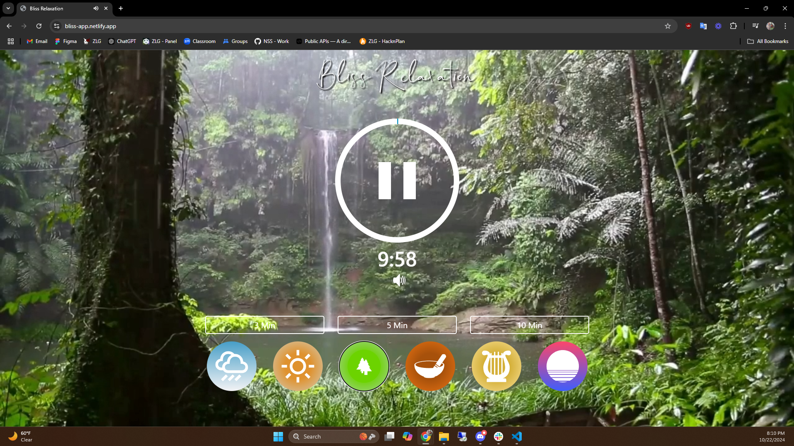

## Bliss Relaxaation App

Bliss Relaxation App is a meditation app designed to help users relax by providing customizable scenes that change both the background video and music settings. It offers a soothing experience by letting users select different environments tailored to their relaxation needs.

## Features

- Scene Customization: Allows users to change scenes with different background videos and calming music for a personalized relaxation experience.
- Dynamic UI: Provides a user-friendly interface for seamless transitions between different meditation settings.

## Tools & Technologies

- JavaScript: Handles the dynamic changes for scenes and music settings.
- Bootstrap: Utilized for creating a responsive and visually appealing user interface.

## Skills & Technologies

- JavaScript
- Bootstrap
- UI/UX Design

